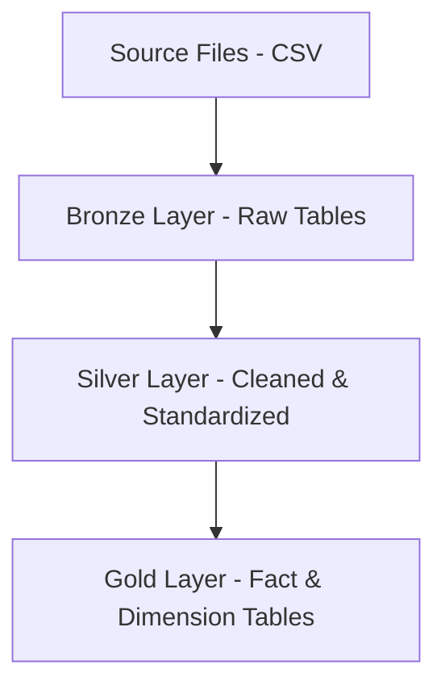

# Data Warehouse Project – Medallion Architecture (Bronze, Silver, Gold)

## Project Overview

This project implements a basic Data Warehouse using the **Medallion Architecture** pattern.

The pipeline ingests raw data from static source files, processes it through structured transformation layers, and produces analytics-ready tables for reporting.

The objective of this project is to simulate a real-world batch ETL workflow and demonstrate understanding of:

- Data warehousing fundamentals  
- Medallion architecture  
- Data modeling (fact & dimension tables)  
- SQL-based transformations  

---

## Architecture Overview

The warehouse is structured into three layers:

### 1. Bronze Layer (Raw Layer)

- Stores raw data exactly as received from source files  
- Minimal or no transformations  
- Maintains original schema structure  
- Acts as historical backup and source of truth  

**Purpose:** Preserve raw data for traceability and reproducibility.

---

### 2. Silver Layer (Cleaned & Transformed Layer)

- Data cleaning (null handling, type casting)  
- Standardization and normalization  
- Deduplication  
- Basic business rule application  

**Purpose:** Create reliable and structured datasets suitable for analytical modeling.

---

### 3. Gold Layer (Analytics Layer)

- Contains fact and dimension tables  
- Structured using star schema  
- Optimized for analytical queries  

**Purpose:** Provide reporting-ready data for BI tools and analytics.

---

## End-to-End Data Flow



---

## Layer-wise Structure (Hierarchy View)

```
Data Warehouse
├── Bronze
│   ├── raw_customers
│   └── raw_orders
│
├── Silver
│   ├── cleaned_customers
│   └── cleaned_orders
│
└── Gold
    ├── dim_customer
    ├── dim_product
    └── fact_sales
```

---

## Data Modeling

The Gold layer follows a **Star Schema** design.

### Fact Table

- Stores measurable business metrics  
- Defined at a specific grain  

**Example Grain:**  
One row per transaction per customer per product per date.

### Dimension Tables

- Provide descriptive attributes  
- Used for filtering and grouping in analytics  
- Linked to fact table using foreign keys  

This structure supports efficient aggregation and reporting.

---

## Tech Stack

- SQL (Structured Query Language)  
- Relational Database System (SQL Server / PostgreSQL / MySQL)  
- Static file ingestion (CSV-based)  
- Query execution via SQL client  

---

## Key Concepts Implemented

- Medallion architecture (Bronze → Silver → Gold)  
- Batch ETL processing  
- Data transformation using SQL  
- Star schema modeling  
- Fact and dimension design  
- Layered data refinement  

---

## Project Structure

```
/scripts
    ├── create_database.sql
    ├── bronze_layer.sql
    ├── silver_layer.sql
    ├── gold_layer.sql
/data
    ├── source_files.csv
/images
    ├── architecture.png   (optional)
/README.md
```

---

## How to Run

1. Create the database.  
2. Execute table creation scripts for Bronze, Silver, and Gold layers.  
3. Load source data into Bronze tables.  
4. Run transformation scripts in sequence:
   - Bronze → Silver  
   - Silver → Gold  
5. Query Gold layer tables for analytics and reporting.  

---

## Limitations

- Static batch loading only  
- No incremental loading  
- No change data capture (CDC)  
- No handling of late-arriving data  
- No schema evolution support  
- No orchestration or scheduling tool  

---

## Future Improvements

- Implement incremental load logic  
- Add data validation and quality checks  
- Handle late-arriving records  
- Add logging and audit tables  
- Automate pipeline with orchestration tool (e.g., Airflow)  
- Deploy to cloud warehouse (e.g., Snowflake, BigQuery)  
- Add streaming ingestion capability  

---

## Learning Outcome

This project demonstrates foundational knowledge of data warehousing principles, layered architecture design, and SQL-based transformation workflows. It serves as a base for building more advanced, production-grade data engineering systems.
