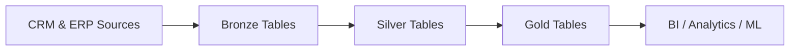

# 🏗️ Data Warehouse Project – Medallion Architecture (Bronze, Silver, Gold)

## 📌 Project Overview

This project implements a layered **SQL Server Data Warehouse** using the **Medallion Architecture** pattern. The system integrates data from multiple enterprise sources (CRM and ERP), processes it through structured transformation layers, and exposes business-ready tables for analytics and reporting.

### 🎯 Objectives

- Implement Bronze → Silver → Gold architecture
- Integrate CRM and ERP source systems
- Apply structured batch ETL using stored procedures
- Design a Star Schema model
- Expose analytics-ready tables for BI & reporting

---

# 🏛️ Architecture Overview

## 🔹 Source Systems

- **CRM**
  - `crm_sales_details`
  - `crm_cust_info`
  - `crm_prd_info`

- **ERP**
  - `erp_cust_az12`
  - `erp_loc_a101`
  - `erp_px_cat_g1v2`

Data originates as structured CSV files and is loaded into SQL Server.

---

## 🥉 Bronze Layer – Raw Data (Tables)

📂 Scripts:
```
scripts/bronze/
    ├── ddl_bronze.sql
    └── proc_load_bronze.sql
```

### Responsibilities

- Stores raw CRM & ERP data
- No transformations
- Full load / truncate-insert pattern
- Schema remains as-is

✔ Object Type: **Tables**  
✔ Load Method: Stored Procedure  
❌ No transformations  

Bronze acts as the immutable staging layer.

---

## 🥈 Silver Layer – Cleaned & Standardized (Tables)

📂 Scripts:
```
scripts/silver/
    ├── ddl_silver.sql
    └── proc_load_silver.sql
```

### Responsibilities

- Data cleansing
- Standardization
- Normalization
- Derived columns
- CRM + ERP integration logic

✔ Object Type: **Tables**  
✔ Load Method: Stored Procedure  
✔ Transformations applied  

This layer prepares structured, reliable datasets for modeling.

---

## 🥇 Gold Layer – Business Ready (Tables)

📂 Scripts:
```
scripts/gold/
    └── ddl_gold.sql
    └── proc_load_gold.sql
```

### Responsibilities

- Star schema implementation
- Fact & Dimension exposure
- Business logic calculations
- Aggregation-ready data

✔ Object Type: **Tables**  
✔ Load Method: Stored Procedure 
✔ Built on top of Silver tables  

Gold provides analytics-ready objects for:

- 📊 BI & Reporting  
- 🔍 Ad-hoc SQL  
- 🤖 Machine Learning  

---

# 🔄 End-to-End Data Flow



---

# 🧩 Data Modeling – Star Schema

The Gold layer exposes a **Star Schema** model:

## ⭐ Fact Table

### `gold.fact_sales`

Grain:
> One row per order per product per customer

Includes:
- order_number 
- product_key
- customer_key
- order_date
- shipping_date
- sales_amount
- quantity
- price

🧮 Sales Calculation:
```
Sales = Quantity × Price
```

---

## 📐 Dimension Tables

### `gold.dim_customers`
- customer_key (PK/SK)
- customer_id
- customer_number
- first_name
- last_name
- country
- gender
- birthdate

### `gold.dim_products`
- product_key (PK/SK)
- product_id
- product_name
- category
- subcategory
- cost
- product_line
- start_date

---

# 🗂️ Repository Structure

```
scripts/
│
├── init_database.sql
│
├── bronze/
│   ├── ddl_bronze.sql
│   └── proc_load_bronze.sql
│
├── silver/
│   ├── ddl_silver.sql
│   └── proc_load_silver.sql
│
└── gold/
    └── ddl_gold.sql
    └── proc_load_gold.sql
```

---

# ▶️ Execution Order

1. Run `init_database.sql`
2. Execute Bronze DDL
3. Execute Silver DDL
4. Execute Gold DDL
5. Run Bronze load procedure
6. Run Silver load procedure
7. Run Gold load procedure

Gold Tables will automatically reflect updated data.

---

# 🛠️ Tech Stack

- Microsoft SQL Server
- Microfodt SSMS
- T-SQL
- Stored Procedures
- Batch Processing
- Star Schema Modeling

---

# 🚀 Future Improvements

- Incremental load strategy
- Logging & audit framework
- Error handling in procedures
- Late-arriving dimension handling
- Airflow / job scheduler integration
- Cloud warehouse deployment

---

# 🎓 Learning Outcome

This project demonstrates:

- Enterprise-style layered warehouse design
- CRM + ERP data integration
- Structured SQL-based ETL
- Star schema modeling
- Analytics exposure

It forms a strong foundation for building production-grade, scalable data engineering systems.
